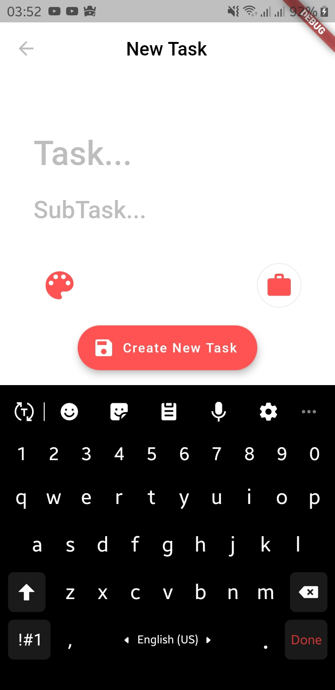
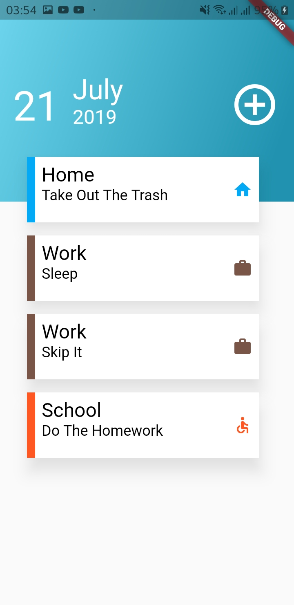
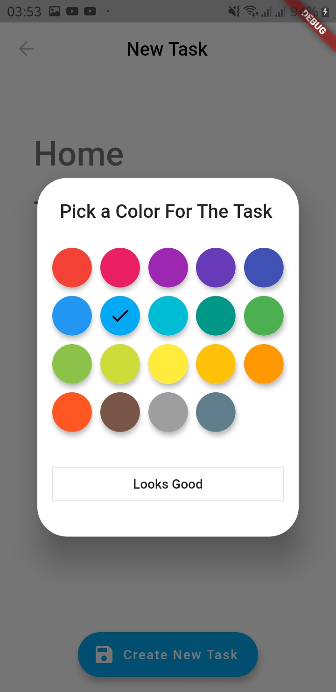
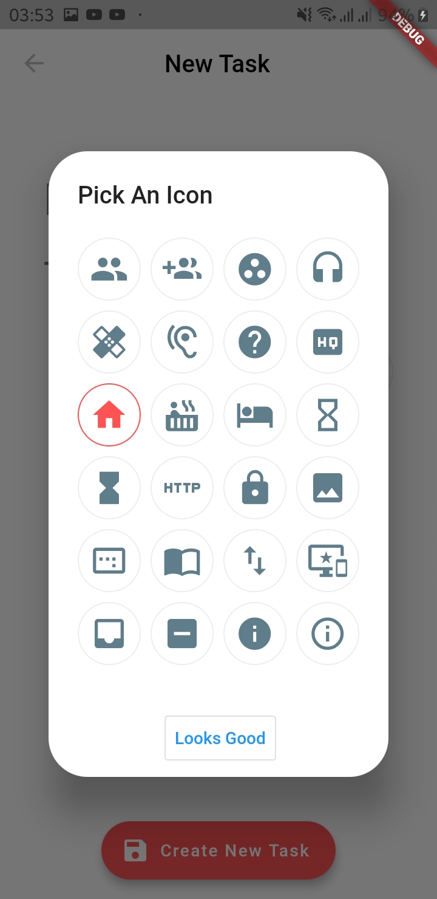
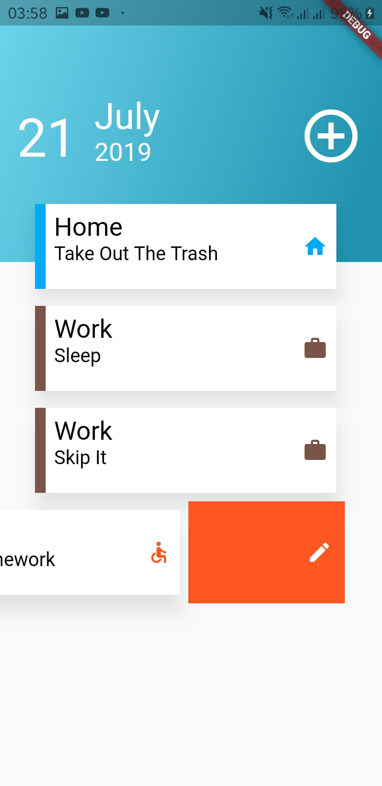
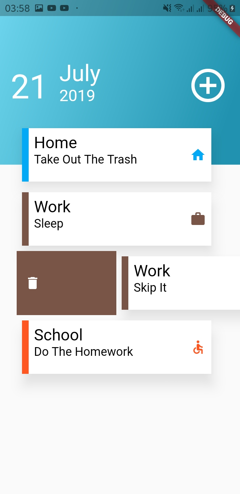

<h1 align="center">
   
  
   
  Todo - Simple & Beautiful
   
</h1>

<h4 align="center">A minimal Todo mobile app made using <a href="https://flutter.dev" target="_blank">Flutter</a>.</h4>

  <a href="#key-features">Key Features</a> •
  <a href="#Overview">Overview</a> •
  <a href="#credits">Credits</a> •

  
  
   
   
   
   
  

## Key Features

* Easily add and remove tasks
* Organize tasks under categories. editing.
* Personalize task category using color and icon. 

## Overview
* The SQL Database was Built Using Flutter Packages Called **Moor** which Is The Flutter version Of **Room** For Native Android
* Moor Makes You Build Fully Type Safe SQL Tabels And Queries Using **Pure Dart**
* The Tasks Are In a Form Of **Dismissibles** To The Right To Edit The Task And To The Left To Delete It
* **TODO** :  Adding Options To Sort And Show Tasks Depending on Color , Icon Or The Same Main Category

## Credits
 
<h4 align="center">Moor is an easy to use, reactive persistence library for Flutter and Dart web apps. Define your database tables in pure Dart and enjoy a fluent query API, auto-updating streams and more! <a href="https://github.com/simolus3/moor" target="_blank">Check This Package Repo </a>.</h4>
